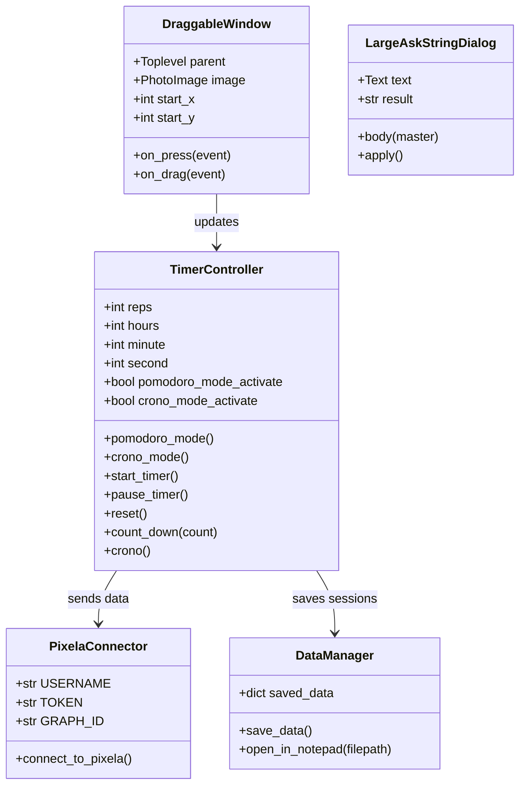

# KEGOMODORO 🍅⏱️

A feature-rich **Pomodoro Timer & Stopwatch** application built with Python and Tkinter, designed to boost productivity with intelligent time tracking, habit visualization, and note-taking capabilities.

---

## 🌟 Features

### Timer Modes
| Mode | Description |
|------|-------------|
| **Pomodoro** | Classic Pomodoro technique with work/short-break/long-break cycles |
| **Stopwatch** | Count-up timer for tracking study/work sessions |

### Core Features
- **🪟 Floating Mini Window** - Draggable, always-on-top timer display (transparent background)
- **📊 Pixela Integration** - Automatic habit tracking via [Pixela](https://pixe.la) graphs
- **📝 Note Taking** - Save timestamped notes with your work sessions
- **🔊 Audio Notifications** - Distinct sounds for work start, break start, and long break
- **⚙️ Configurable Timers** - Customize work, short break, and long break durations
- **💾 Persistent State** - Remembers your timer progress between sessions

### Pomodoro Cycle
```
Work (25 min) → Short Break (5 min) → Work → Short Break → 
Work → Short Break → Work → Long Break (20 min) → Repeat
```
*After 4 work sessions, you get a long break!*

---

## 📁 Project Structure

```
kegomodoro/
├── main.py                          # Main application (744 lines)
└── dependencies/
    ├── audios/                      # Sound effects
    │   ├── new_work.mp3             # New work session sound
    │   ├── work.mp3                 # Work period sound
    │   ├── short_break.mp3          # Short break notification
    │   └── long_break.mp3           # Long break notification
    ├── images/                      # Visual assets
    │   ├── behelit.png              # Floating window image
    │   ├── icon.ico                 # Application icon
    │   ├── main_image.png           # Main timer display image
    │   └── signature.png            # KEGAN Software logo
    ├── texts/
    │   ├── KAÆ[Æß#.txt              # Saved notes file
    │   └── Configurations/
    │       ├── configuration.csv    # Timer settings (work/break durations)
    │       ├── time.csv             # Stopwatch time persistence
    │       └── floating_window_checker.txt  # Floating window state
    └── old theme (optional)/        # Alternative theme assets
```

---

## 🔧 Technical Architecture

### Class Diagram



### Key Components

| Component | Responsibility |
|-----------|----------------|
| **Timer Controller** | Manages Pomodoro/Stopwatch logic, countdown/countup mechanisms |
| **Draggable Window** | Floating mini-timer that stays on top of other windows |
| **Pixela Connector** | Syncs work hours to Pixela habit tracking graphs |
| **Data Manager** | Persists timer state, configurations, and notes |
| **Audio Manager** | Plays notification sounds using pygame |

---

## 🎮 User Interface

### Main Window
- **Mode Selection**: Radio buttons for Pomodoro / Stopwatch
- **Timer Display**: Large digital clock showing current time
- **Control Buttons**: Start, Pause, Reset, Save
- **Progress Checkmarks**: Visual indicators for completed Pomodoro cycles (✔✔✔✔)
- **Floating Window Toggle**: Checkbox to show/hide mini timer

### Floating Window
- **Always-on-top** transparent window with timer display
- **Draggable** - click and drag anywhere to reposition
- **Persistent position** - remembers show/hide state between sessions

---

## ⚙️ Configuration

### Timer Settings (`configuration.csv`)
```csv
WORK_MIN,SHORT_BREAK_MIN,LONG_BREAK_MIN,NOTEPAD_MODE
25,5,20,FALSE
```

| Setting | Default | Description |
|---------|---------|-------------|
| `WORK_MIN` | 25 | Work session duration (minutes) |
| `SHORT_BREAK_MIN` | 5 | Short break duration (minutes) |
| `LONG_BREAK_MIN` | 20 | Long break duration (minutes) |
| `NOTEPAD_MODE` | FALSE | If TRUE, opens notepad instead of dialog for notes |

### Pixela Integration
Configure your Pixela credentials in `main.py`:
```python
PIXELA_ENDPOINT = "https://pixe.la/v1/users"
USERNAME = "your_username"
TOKEN = "your_token"
GRAPH_ID = "graph1"
```

---

## 📦 Dependencies

```
pygame          # Audio playback
pandas          # CSV data handling
Pillow          # Image processing
requests        # Pixela API communication
pyautogui       # Mouse position utilities
keyboard        # Keyboard input detection
tkinter         # GUI framework (built-in)
```

### Installation
```bash
pip install pygame pandas Pillow requests pyautogui keyboard
```

---

## 🚀 Usage

### Run the Application
```bash
cd kegomodoro
python main.py
```

### Workflow
1. **Select Mode** - Choose Pomodoro or Stopwatch
2. **Start Timer** - Click "Start" to begin
3. **Enable Floating Window** - Check "SmallWindow" for mini display
4. **Take Notes** - Click "Save" to record session with notes
5. **Track Progress** - Check your Pixela graph for habit visualization

---

## 🎨 Color Scheme

| Color | Hex | Usage |
|-------|-----|-------|
| Dark Red | `#8B0000` | Primary background |
| Deep Gold | `#EFB036` | Break mode indicator |
| Orange | `#EB5B00` | Timer label |
| Gold | `#fcba03` | Mode labels |
| Deep Red | `#cc2b33` | Floating timer background |

---

## 🔊 Audio Files

| File | Trigger |
|------|---------|
| `new_work.mp3` | First work session after long break |
| `work.mp3` | Work session start (after breaks) |
| `short_break.mp3` | Short break start (50% volume) |
| `long_break.mp3` | Long break start |

---

## 📊 Data Persistence

### Saved Notes Format (`KAÆ[Æß#.txt`)
```
12/21/2025
01:45:23 Focus session on Python project

12/21/2025
00:25:00 Reading documentation
```

### Time Tracking (`time.csv`)
```csv
hours,minute,second
0,45,30
1,12,15
```

---

## 🛠️ Future Improvements

- [ ] Settings UI for timer configurations
- [ ] Statistics dashboard with charts
- [ ] Task categorization
- [ ] Daily/weekly goals
- [ ] Export reports to PDF
- [ ] Dark/Light theme toggle
- [ ] Keyboard shortcuts

---

## 👨‍💻 Author

**KEGAN Software**

---

## 📄 License

This project is for personal use and educational purposes.
